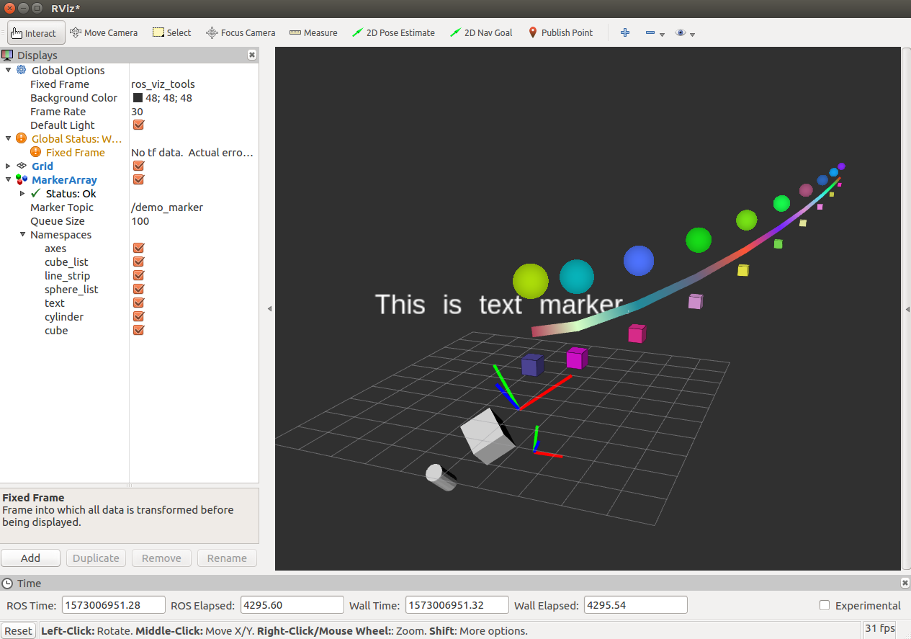

# ros_viz_tools

This package is a visualization tool for easier Rviz [marker](http://wiki.ros.org/rviz/DisplayTypes/Marker) plotting.

## Dependencies

- Tested on Ubuntu 16.04 LTS & ROS kinetic
- tf2_geometry_msgs

## Quick Start

Build this package under your catkin workspace, run demo node and Rviz (frame: `ros_viz_tools`, topic: `demo_marker`) for a quick look:

```bash
roslaunch ros_viz_tools demo_node.launch
```



Currently support:

- Cube list
- Sphere list
- Line Strip
- Line List
- Cylinder
- Cube
- Sphere
- Arrow
- Text
- Frame (Axes-type Pose)

## Usage

Set catkin package dependencies in your `CMakeLists.txt` and `package.xml`,

```cmake
# CMakeLists.txt
find_package(catkin REQUIRED COMPONENTS
  ...
  ros_viz_tools
)
```

```xml
<!-- package.xml -->
<?xml version="1.0"?>
<package format="2">
  ...  
  <depend>ros_viz_tools</depend>
  ...
</package>
```

Include the header file in your codes,

```c++
#include "ros_viz_tools/ros_viz_tools.h"
```

### Markers

Initialize a `RosVizTools` instance named  `markers`,

```c++
ros::NodeHandle n;
std::string topic = "demo_marker";
ros_viz_tools::RosVizTools markers(n, topic);
```

Create a new marker and append it to `markers`. Let's take cube list marker for example.

```c++
// set marker frame id, namespace and id
std::string frame_id = "ros_viz_tools";
std::string ns = "cube_list";
int id = 0;
```

You can initialize a new marker by two approaches:

```c++
// intialize new marker by calling static member function in RosVizTools directly (recommended)
visualization_msgs::Marker marker = ros_viz_tools::RosVizTools::newCubeList(0.5, ns, id, ros_viz_tools::WHITE, frame_id);
// or by accessing the function through the instance
visualization_msgs::Marker marker = markers.newCubeList(0.5, ns, id, ros_viz_tools::WHITE, frame_id);
```

If the new marker involves a list (cube list, sphere list, line list or line strip), you also need to set a point list.

```c++
// modify marker, cube list, for example, also needs a point list.
for (int i = 0; i < 10; ++i) {
    geometry_msgs::Point p;
    p.x = i;
    p.y = pow(p.x, 2.0);
    p.z = 1.0;
    marker.points.push_back(p);
    std_msgs::ColorRGBA color = ros_viz_tools::newColorRGBA(randRGB(e), randRGB(e), randRGB(e));
    marker.colors.push_back(color);
}
```

Append new marker to `RosVizTools` instance `markers`:

```c++
// append to markers
markers.append(marker);
```

At the end, call `publish()` function.

```c++
markers.publish();
```

Then you can open Rviz and see the markers published in the frame `ros_viz_tools` and topic `demo_marker`. Don't forget clear your markers at the beginning of every loop:

```c++
markers.clear();
```

You can see [demo_node.cpp](./src/demo_node.cpp) for better understanding of the usage for each marker type.

### Colors

To support colorful marker plotting, `ros_viz_tools` also defines functions and class for easier color settings. Now there are two approaches supported for generating colors:

* function `newColorRGBA` (also with some pre-defined colors in `color.h`) or
* class `ColorMap` (See `demo_node.cpp` for examples)

## License

This repository licensed under the [MIT License](./LICENSE).